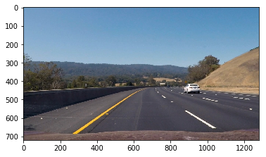
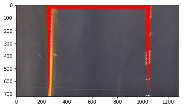
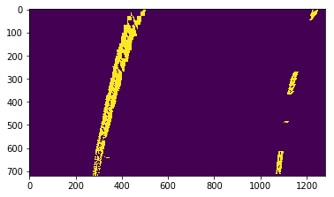

```python
import numpy as np
import cv2, os, re
import matplotlib.pyplot as plt
import matplotlib
%matplotlib inline
import glob
import matplotlib.image as mpimg
import pickle
from moviepy.editor import VideoFileClip
import constants as c
from utils import *
```

#### Compute the camera calibration matrix and distortion coefficients given a set of chessboard images.

I looped through the provided sample camera calibration images using cv2.findChessboardCorners function to store the object points (3D points in real world space) and image points (2D points in image plane) of the grid corners.   These object points and image points are used in  cv2.calibrateCamera() to return the camera matrix, distortion coefficients, rotation and translation vectors. After the initial calibration step, the  parameters are cached in a pickle for resuse later.

The undistort function can now be used to undistort any image captured by the same camera. 


```python
def get_distortion_params(calibration_path):
    # prepare object points, like (0,0,0), (1,0,0), (2,0,0) ....,(6,5,0)
    objp = np.zeros((6*9,3), np.float32)
    objp[:,:2] = np.mgrid[0:9, 0:6].T.reshape(-1,2)

    # Arrays to store object points and image points from all the images.
    objpoints = [] # 3d points in real world space
    imgpoints = [] # 2d points in image plane.
    
    # Make a list of calibration images
    images = glob.glob(calibration_path)

    # Step through the list and search for chessboard corners
    for idx, fname in enumerate(images):
        img = mpimg.imread(fname)
        gray = cv2.cvtColor(img, cv2.COLOR_RGB2GRAY)
      
        # Find the chessboard corners
        ret, corners = cv2.findChessboardCorners(gray, (9,6), None)

        # If found, add object points, image points
        if ret == True:
            objpoints.append(objp)
            imgpoints.append(corners)
    # Return distortion matrix
    img = cv2.imread('test_images/straight_lines1.jpg')
    img_size = (img.shape[1], img.shape[0])
    ret, mtx, dist, rvecs, tvecs = cv2.calibrateCamera(objpoints, imgpoints, img_size,None,None)
    return mtx, dist

def create_undistorter(calibration_images):
    dist_pickle = {}
    mtx = None
    dist = None
    try:
        dist_pickle = pickle.load( open( "calibrate_camera.p", "rb" ) )
        print("Loaded undistorter from pickle {0}".format('calibrate_camera.p'))
        mtx = dist_pickle["mtx"]
        dist = dist_pickle["dist"]
    except:
        mtx,dist = get_distortion_params(calibration_images)
        dist_pickle = {'mtx': mtx, 'dist': dist}
        with open('calibrate_camera.p', 'wb') as f:
            pickle.dump(dist_pickle, f)
    return lambda x: cv2.undistort(x, mtx, dist, None, mtx)
                                     
undistort = create_undistorter("camera_cal/*.jpg")

```

    Loaded undistorter from pickle calibrate_camera.p


#### Apply a distortion correction to raw images.

The results of applying the undistortion to the set of test images in show below:


```python
raw_images = [mpimg.imread(img) for img in glob.glob('test_images/*.jpg')]

visualise_in_squaregrid(raw_images,"Raw Images","output_images/raw_images.jpg")
undistorted_images = [undistort(img) for img in raw_images]
visualise_in_squaregrid(undistorted_images,"Undistorted Images","output_images/undistorted_images.jpg")

```


#### Use color transforms, gradients, etc., to create a thresholded binary image.
The following pipeline of filters generates a binary image with candidate pixels which can then be used in the lane detection steps. The pipline uses a combination of a sobel based gradient transform based on the magnitude, direction (near vertical) filters combined with a colour thresholding which retains the yellow and white band pixels. THe result of this transform is shown


```python
def binarize(img):
    gray = img[:, :, 2]
    dir_binary = dir_thresh(gray,sobel_kernel=15)
    mag_binary = mag_thresh(gray,sobel_kernel=15)
    colour_binary = filter_colours(img)
    combined_binary = np.zeros_like(colour_binary)
    combined_binary[((colour_binary == 1) & ((mag_binary == 1) | (dir_binary == 1)))] = 1
    return combined_binary
    
img = mpimg.imread('test_images/test3.jpg')
showimage(img)
combined_binary = binarize(img)
showimage(combined_binary)
```





#### Apply a perspective transform to rectify binary image ("birds-eye view").
The following step provides a set of lambda function for warping (from perspective to birds eye) and unwarping (bird's eye to perspective) transformation; the warping function uses the perspective transform which was provided a set of 4 points on a trapezoidal arrangement and then mapped to a rectangular arrangement for 'rectifying' the image. The points on the trapezoid were tagged manually in the maplotlib interactive mode. The perspectives return the M amd M_INV transform matrices which are conditioned into the warp and unwarp closures.


```python
def create_perspective_warpers(img):
    h,w = (img.shape[0], img.shape[1])
    
    m = cv2.getPerspectiveTransform(c.SRC, c.DST)
    m_inv = cv2.getPerspectiveTransform(c.DST, c.SRC)
    
    warp = lambda x: cv2.warpPerspective(x, m, (w,h), flags=cv2.INTER_LINEAR)
    unwarp = lambda x: cv2.warpPerspective(x, m_inv, (x.shape[1], x.shape[0]), flags=cv2.INTER_LINEAR) 

    return warp, unwarp 
```

The results of the bird's eye tranform is shown below:


```python
img = mpimg.imread('test_images/straight_lines1.jpg')
if len(img.shape) > 2 and img.shape[2] == 4:
    img = cv2.cvtColor(img, cv2.COLOR_RGBA2RGB)
undistorted = undistort(img)
warp, unwarp = create_perspective_warpers(undistorted)
pts = np.array([[260, 680],[580, 460],[700, 460], [1040, 680]], np.int32)
pts = pts.reshape((-1,1,2))
cv2.polylines(undistorted, [pts], False, (255,0,0), 2)
showimage(undistorted)
print("Undistorted Image with a test trapezoid line")
warped = warp(undistorted)
showimage(warped)
print("Birds eye view of the undistorted image")
undistorted = undistort(img)
warp, unwarp = create_perspective_warpers(img)
raw_images = [mpimg.imread(img) for img in glob.glob('test_images/*.jpg')]
undistorted_images = [undistort(img) for img in raw_images]
warped_images = [warp(img) for img in undistorted_images]
warped_binaries = [binarize(img) for img in warped_images]
visualise_in_squaregrid(warped_binaries,"Bird's eye view of test images","output_images/warped_images.jpg")


```


    Undistorted Image with a test trapezoid line





    Birds eye view of the undistorted image


#### Detect lane pixels and fit to find the lane boundary.

The lane detection process consists of 2 steps. 
1. Brute force search (hist_search): this first step uses a a histogram analysis of the bottom half of the frame to detect 'hot' area for the lanes. Then a sliding window approach (9 windows were used) to  detect nonzero pixels  from the binary image within the sliding window boundary and append it to list of left and right lane pixel arrays. The s ttep is mirrored across the right and left halves of the images to detect the left and right lane pixels. THe aggregate lane pixels from the sliding window search is then curve fitted (fit_curve function) to a second degreee polynomial which is then used in the second step (local_search) to speed up the search process in sunsequent frames.
2. Local search: this uses the lane curves from the histogram search to search for lane pixels in the vicintiy of the curves. the process is the same as the histogram search except that no histogram analysis is required because we already know the area in which we are likely ti find lanes. In sunsequent frames the local search may return poor results because of changing road topologies and therefore we may have to fall back to the histogram search to re-prime the search. This needs to be handled in the video processing pipeline.


```python
"""takes a set of candidate left and right lane pixels 
    and returns a fitted line to the second polynomial degree
    the real_space parameter if set applies a pixel to meter 
    conversion factor on each dimension"""
def fit_curve(l_x, l_y, r_x, r_y, real_space=False):
    # fit curve using second order polynomial 
    # multiplier for meter or pixel space.
    ymult = c.YM_PP if real_space else 1
    xmult = c.XM_PP if real_space else 1
    
    l_fit = np.polyfit(l_y* ymult, l_x*xmult, 2)
    r_fit = np.polyfit(r_y* ymult, r_x*xmult, 2)
    return l_fit, r_fit


"""visualisation function for checking fitted lanes"""
def plot_curves(wb, l_fit, r_fit):
    res_img = np.dstack((wb, wb, wb))*255
    h,w = wb.shape
    w =4
    ys = np.linspace(0, h - 1, h)
    l_xs = l_fit[0] * (ys**2) +l_fit[1] * ys + l_fit[2]
    r_xs = r_fit[0] * (ys**2) + r_fit[1] * ys + r_fit[2]
    xls, xrs, ys = l_xs.astype(np.uint32), r_xs.astype(np.uint32), ys.astype(np.uint32)
    
    for xl, xr, y in zip(xls, xrs, ys):
        cv2.line(res_img, (xl - w, y), (xl + w, y), (255, 255, 0), w)
        cv2.line(res_img, (xr - w, y), (xr + w, y), (0, 0, 255), w)
    return res_img

```


```python
# Lane-Finding      
def hist_search(wb):
    # pass in a warped binary image"
    # Take a histogram of the bottom half of the image
    h,w = wb.shape
    hist = np.sum(wb[int(h/2):,100:w-100], axis=0)#bottom half of frame
    mid = int(hist.shape[0]/2)
    
    # Find the peak of the left and right halves of the histogram
    l_cx = np.argmax(hist[:mid])
    r_cx = np.argmax(hist[mid:]) + mid
    
    # Choose the number of sliding windows
    num_windows = 9
    win_h = np.int(h/num_windows)
    s_margin = 100 #width of sliding window
    citical_mass = 50
    
    # Current window
    l_current = None
    r_current = None
    
    # Identify the nonzero pixels
    nonzero_y, nonzero_x = nonzero(wb)
    
    # Create empty lists to receive left and right lane pixel indices
    l_lane_idxs = []
    r_lane_idxs = []
   
    # Step through the windows one by one
    for i in range(num_windows):
        if(i==0):
            l_current = SlidingWindow(s_margin,h,l_cx,win_h)
            r_current = SlidingWindow(s_margin,h,r_cx,win_h)
        else:
            l_current.move(l_cx)
            r_current.move(r_cx)
        
        # Identify the nonzero pixels within the window and append to previous non-zero
        w_l_idxs = indices_within_win_limits(nonzero_x,nonzero_y,l_current.x_lo,l_current.y_lo,l_current.x_hi,l_current.y_hi)
        w_r_idxs = indices_within_win_limits(nonzero_x,nonzero_y,r_current.x_lo,r_current.y_lo,r_current.x_hi,r_current.y_hi)
        
        # If you found > citical_mass pixels, recenter next window
        if len(w_l_idxs) > citical_mass:
            l_cx = np.int(np.mean(nonzero_x[w_l_idxs]))
        if len(w_r_idxs) > citical_mass:        
            r_cx = np.int(np.mean(nonzero_x[w_r_idxs]))
    
        l_lane_idxs.append(w_l_idxs)
        r_lane_idxs.append(w_r_idxs)
        
    # Concatenate the arrays of indices
    l_lane_idxs = np.concatenate(l_lane_idxs)
    r_lane_idxs = np.concatenate(r_lane_idxs)
    
    # find pixel positions
    l_x = nonzero_x[l_lane_idxs]
    l_y = nonzero_y[l_lane_idxs] 
    r_x = nonzero_x[r_lane_idxs]
    r_y = nonzero_y[r_lane_idxs] 
    
    l_fit, r_fit = fit_curve(l_x, l_y, r_x, r_y) 
    return l_fit, r_fit
 

#search around the lanes found in the initial search
def local_search(wb, l_fit, r_fit, plot=False):
    h,w = wb.shape
    nonzero_y, nonzero_x = nonzero(wb)
    margin = 100
    l_mid = (l_fit[0]*(nonzero_y**2) + l_fit[1]*nonzero_y + l_fit[2])
    r_mid = (r_fit[0]*(nonzero_y**2) + r_fit[1]*nonzero_y + r_fit[2])
    l_lane_idxs = ((nonzero_x >  (l_mid - margin )) & (nonzero_x <  (l_mid + margin) )).nonzero()[0]   
    r_lane_idxs = ((nonzero_x >  (r_mid - margin )) & (nonzero_x <  (r_mid + margin ))).nonzero()[0]   
    
    # find pixel positions
    l_x = nonzero_x[l_lane_idxs]
    l_y = nonzero_y[l_lane_idxs] 
    r_x = nonzero_x[r_lane_idxs]
    r_y = nonzero_y[r_lane_idxs]
    
    l_fit, r_fit = fit_curve(l_x, l_y, r_x, r_y)
    return l_fit, r_fit


```


        
#### Determine the curvature of the lane and vehicle position with respect to center. 
We calculate the radius of curvature using the lane fit parameters, according to this formula, where (A) and (B) are fit estimations. Before we apply the formula, the curves are re-mapped to the real world space in meters using conversion constants ~ 3.7 meters for the width of the lanes.

$$[ R_{curve} = \frac{\left(1 + \left(2 A y + B\right)^2\right)^{3/2}}{\left| 2 A \right|} ]$$

The car position is an average of the difference of the 2 lane bottoms (in pixel space) from the center of the image which is then mapped to real world space(meters). 


```python
"""helper function that takes a line and 
    returns the curvature in original units"""
def get_curvature_radius(line, y):
    A, B, C = line
    return np.power(1 + np.square(2 * A * y + B), 3 / 2) / np.abs(2 * A)

"""takes in the lane curves and 
    returns the left and right curvatures in meter units"""
def curvature_in_meters(wb,l_fit,r_fit):
    h,w = wb.shape
    ys = np.linspace(0, h - 1, h)
    l_x = l_fit[0] * (ys**2) +l_fit[1] * ys + l_fit[2]
    r_x = r_fit[0] * (ys**2) + r_fit[1] * ys + r_fit[2]
    #refit to real space
    l_fitr, r_fitr = fit_curve(l_x, ys, r_x, ys,real_space=True)
    l_rad = get_curvature_radius(l_fitr,h*c.YM_PP)
    r_rad = get_curvature_radius(r_fitr,h*c.YM_PP)
    return l_rad, r_rad
```

#### Warp the detected lane boundaries back onto the original image.Output visual display of the lane boundaries and numerical estimation of lane curvature and vehicle position.

The lanes in the real world space are then plotted using a polygon fill on to an overlay image with 30% transparency but not before unwarping the overlay back into perspective view so that it matches the camera view.


```python

def plot_lane(wb, l_fit, r_fit, l_rad, r_rad, undistorted, unwarp):
    h,w = wb.shape
    
    # Create a overlay image to draw the lines on
    overlay = np.zeros_like(wb).astype(np.uint8)
    overlay = np.dstack((overlay, overlay, overlay))
    
    # lane pixels 
    ys = np.linspace(0, h-1, h )
    l_fit_x = l_fit[0]*ys**2 + l_fit[1]*ys + l_fit[2]
    r_fit_x = r_fit[0]*ys**2 + r_fit[1]*ys + r_fit[2]
    
    # Reshape for cv2.fillPoly()
    l_xy = np.array([np.transpose(np.vstack([l_fit_x, ys]))])
    r_xy = np.array([np.flipud(np.transpose(np.vstack([r_fit_x, ys])))])
    pts = np.hstack((l_xy, r_xy))
    
    # Plot lane on overlay image
    cv2.fillPoly(overlay, np.int_([pts]), (0,200, 255))
    
    # Unwarp the overlay and combine with undistorted image
    overlay = unwarp(overlay)
    combined = cv2.addWeighted(undistorted, 1, overlay, 0.3, 0)
    
    # plot lane curvatures
    cv2.putText(combined, "Left  Curvature radius: %.0f m" % (l_rad), (40,40), cv2.FONT_HERSHEY_COMPLEX, 1, (255,255,255), 2)
    cv2.putText(combined, "Right Curvature radius: %.0f m" % (r_rad), (40,80), cv2.FONT_HERSHEY_COMPLEX, 1, (255,255,255), 2)
    cv2.putText(combined, "Mean Curvature radius: %.0f m" % ((l_rad+r_rad)/2), (40,120), cv2.FONT_HERSHEY_COMPLEX, 1, (255,255,255), 2)
    # plot offset from centre
    l_bottom = l_fit_x[-1]
    r_bottom = r_fit_x[-1]
    cv2.putText(combined, "Car position: %.2f m" % ((np.average((l_bottom + r_bottom)/2) - w//2)*c.XM_PP), (40,160), cv2.FONT_HERSHEY_COMPLEX, 1, (255,255,255), 2)
    return combined
```

The lane detection and curve plots are illustrated below. 


```python

img = mpimg.imread('test_images/test3.jpg')
if len(img.shape) > 2 and img.shape[2] == 4:
    img = cv2.cvtColor(img, cv2.COLOR_RGBA2RGB)
undistorted = undistort(img)
showimage(undistorted)
binarized = binarize(undistorted)
warp, unwarp = create_perspective_warpers(binarized)
wb = warp(binarized)
print("Bird's eye binary image")
showimage(wb)
l_fit, r_fit = hist_search(wb)
res_img = plot_curves(wb,l_fit,r_fit)
print("Curve plots of lanes detected from histogram search")
showimage(res_img)
l_fit, r_fit = local_search(wb,l_fit,r_fit, plot=True )
l_rad, r_rad = curvature_in_meters(wb,l_fit, r_fit)
res_img = plot_lane(wb,l_fit,r_fit,l_rad, r_rad,undistorted, unwarp )
print("Fully annotated image after local search, unwarping and curvature + position calclulation")
showimage(res_img)


```


    Bird's eye binary image





    Curve plots of lanes detected from histogram search


    Fully annotated image after local search, unwarping and curvature + position calclulation


###Pipeline (video)

####1. Provide a link to your final video output. Your pipeline should perform reasonably well on the entire project video (wobbly lines are ok but no catastrophic failures that would cause the car to drive off the road!).

The video processing pipline take the original image, undistorts, thresholds(binarize), converts to bird's eye view (warp) and then does lane fitting using histogrram and then local search. To avoid jitter because of poor lane search results on account of difficult lighting and road conditions, the pipeline does averaging of the lane fits across a tunable set of historical lane detections. It applies  weighte to the histoical search models. The weight model applies decresing order of importance to results from older frames.

Here's a link to my video result:


```python
from IPython.display import YouTubeVideo
YouTubeVideo('NfIfQjMMCR4')
```


        <iframe
            width="400"
            height="300"
            src="https://www.youtube.com/embed/NfIfQjMMCR4"
            frameborder="0"
            allowfullscreen
        ></iframe>
        


```python
from collections import deque
import cProfile

def pipeline(relevant_hist=c.RELEVANT_HIST):
    weights = np.arange(1,relevant_hist+1)/relevant_hist
    print(weights)
    l_fits = deque(maxlen=relevant_hist)
    r_fits = deque(maxlen=relevant_hist)
    
    def append(l_fit, r_fit):
        l_fits.append(l_fit)
        r_fits.append(r_fit)
        
    def get_relevant_history():
        return np.average(l_fits,0,weights[-len(l_fits):]), np.average(r_fits,0,weights[-len(l_fits):])
                   
         
    def process_image(img):
        undistorted = undistort(img)
        wb = warp(binarize(undistorted))
        l_fit, r_fit = hist_search(wb) if ((len(l_fits)==0) ) else local_search(wb,np.average(l_fits,0,weights[-len(l_fits):]), np.average(r_fits,0,weights[-len(l_fits):]))
        append(l_fit, r_fit)
        l_avg,r_avg = get_relevant_history()
        l_rad, r_rad = curvature_in_meters(wb, l_avg,r_avg)
        res_img = plot_lane(wb,l_avg, r_avg,l_rad,r_rad,undistorted,unwarp)
        return res_img
    return process_image

# #+RESULTS:

in_clip = VideoFileClip("project_video.mp4")
#in_clip = in_clip.subclip(30, 50)
out_clip = in_clip.fl_image(pipeline(5))
cProfile.run('out_clip.write_videofile("output_images/project_output.mp4", audio=False)', 'restats')
```

    [ 0.2  0.4  0.6  0.8  1. ]
    [MoviePy] >>>> Building video output_images/project_output.mp4
    [MoviePy] Writing video output_images/project_output.mp4


    100%|█████████▉| 1260/1261 [04:50<00:00,  4.26it/s]


    [MoviePy] Done.
    [MoviePy] >>>> Video ready: output_images/project_output.mp4 
    


#### Discussion

This was a very challenging  and interesting project and exposed me to several new concepts in the area of computer vision particularly camera calibration and the use of jistogram analysis for search optimization and the use of different colours spaces and how they behave in different lighting conditions. The effect of lighting conditions is particularly amplified in the harder challenge video (which I have not described in this writeup).

The colour thresholding seems to have the biggest impact on thresholding as compared to gradient and magnitude thresholding. 


#### Improvements:

Clearly the code can do with a lot of refactoring which I hope to address in the near term. The lane detection functions defintely need improvement to handle edge cases such as not detecting lanes (in such a case polyfit would fail). There could be other masks that could be applied e.g. ROI (trapezoid) masks to speed up lane detection.


```python

```
